# xsukax KML/KMZ Map Viewer

## 🗺️ Project Overview

The **xsukax KML/KMZ Map Viewer** is a professional geospatial web application designed for interactive visualization of **KML** and **KMZ** files directly within the browser. Built using **Leaflet**, **Bootstrap 5**, and **OpenStreetMap**, this tool enables users to seamlessly upload and render geospatial data layers without requiring any server-side processing or installations.

Users can upload `.kml` or `.kmz` files through an intuitive drag-and-drop interface, instantly visualize geographic features, and explore metadata interactively through dynamic popups and tooltips. The project emphasizes simplicity, responsiveness, and high-quality map rendering — ideal for GIS professionals, analysts, and developers needing a quick and secure way to preview geospatial datasets.

---

## 🔒 Security and Privacy Benefits

The **xsukax KML/KMZ Map Viewer** prioritizes user privacy and data security through several deliberate architectural decisions:

* **Client-Side Data Processing:** All file parsing and visualization occur locally in the user’s browser. Uploaded files are never transmitted to a remote server, ensuring full **data confidentiality**.
* **No External Storage:** Files remain in local memory during the session and are cleared upon page refresh or when the **“Clear Map”** button is used.
* **Open-Source Transparency:** Users can inspect and verify the source code to ensure no hidden data collection or external dependencies compromise privacy.
* **Secure Dependencies:** The project leverages well-maintained and trusted libraries like **Leaflet**, **JSZip**, and **toGeoJSON**, all loaded over **HTTPS** from reliable CDNs.

This privacy-by-design approach ensures the application is safe for viewing sensitive or proprietary geographic data.

---

## ⚙️ Features and Advantages

* **Instant Map Rendering:** Upload `.kml` or `.kmz` files to visualize geospatial layers instantly.
* **KMZ Extraction:** Integrated **JSZip** engine automatically extracts embedded KML files from KMZ archives.
* **Interactive Map Elements:** Features include tooltips, popups, and highlighted geometries for enhanced clarity.
* **Responsive and Modern UI:** Built with **Bootstrap 5** and **Animate.css** for smooth transitions and professional design.
* **Offline Operation:** Fully functional without network connectivity after initial load.
* **One-Click Clearing:** Users can remove loaded layers instantly via the **“Clear Map”** control.
* **Data Integrity Indicators:** Visual and textual status feedback ensures clear user interaction.
* **Custom Styling:** Automatic color styling of map features with thematic consistency.

These advantages make xsukax KML/KMZ Map Viewer a versatile and efficient solution for GIS data visualization in browser-based workflows.

---

## 💻 Installation Instructions

### Prerequisites

* Any modern web browser (Chrome, Edge, Firefox, Safari)
* Internet connection (for loading library dependencies via CDN)

### Steps

1. **Clone the repository:**

   ```bash
   git clone https://github.com/xsukax/xsukax-KML-KMZ-Map-Viewer.git
   ```
2. **Navigate to the project directory:**

   ```bash
   cd xsukax-KML-KMZ-Map-Viewer
   ```
3. **Open the application:**
   Simply open the `index.html` file in your browser.

   ```bash
   open index.html
   ```

No build process or backend setup is required — the application runs natively in the browser.

---

## 🚀 Usage Guide

1. **Launch the Viewer:** Open `index.html` in your browser.
2. **Upload File:** Click the **“Select KML/KMZ File”** button or drag and drop a `.kml` or `.kmz` file into the upload area.
3. **Visualize Data:** The map will automatically render your features with distinct styles and labels.
4. **Inspect Features:** Click any feature on the map to view metadata in a popup.
5. **Clear Map:** Click the **“Clear Map”** button to remove all layers and reset the interface.

### 🧭 Process Flow (Mermaid Diagram)

```mermaid
graph TD
A[User selects .kml or .kmz file] --> B{File Type?}
B -->|KML| C[Parse KML → Convert to GeoJSON]
B -->|KMZ| D[Extract KML with JSZip → Parse → Convert]
C --> E[Render on Leaflet Map]
D --> E[Render on Leaflet Map]
E --> F[Display Popups, Tooltips, and Layers]
F --> G[User Interaction: Zoom, Pan, Inspect]
G --> H[Optionally Clear Map]
```



### Example Workflow

```text
1. Select File → my_data.kmz
2. App extracts KML → converts to GeoJSON → displays map layers
3. User clicks feature → popup shows metadata
4. Click “Clear Map” → reset view
```

---

## 🧾 Licensing Information

This project is licensed under the **GNU General Public License v3.0**.

---

### 🌍 Repository

GitHub: [xsukax/xsukax-KML-KMZ-Map-Viewer](https://github.com/xsukax/xsukax-KML-KMZ-Map-Viewer)

---

### 💡 Author

**xsukax** — Creator and maintainer of the xsukax KML/KMZ Map Viewer.

Contributions and feedback are welcome! Feel free to open issues or pull requests to enhance functionality or improve documentation.
